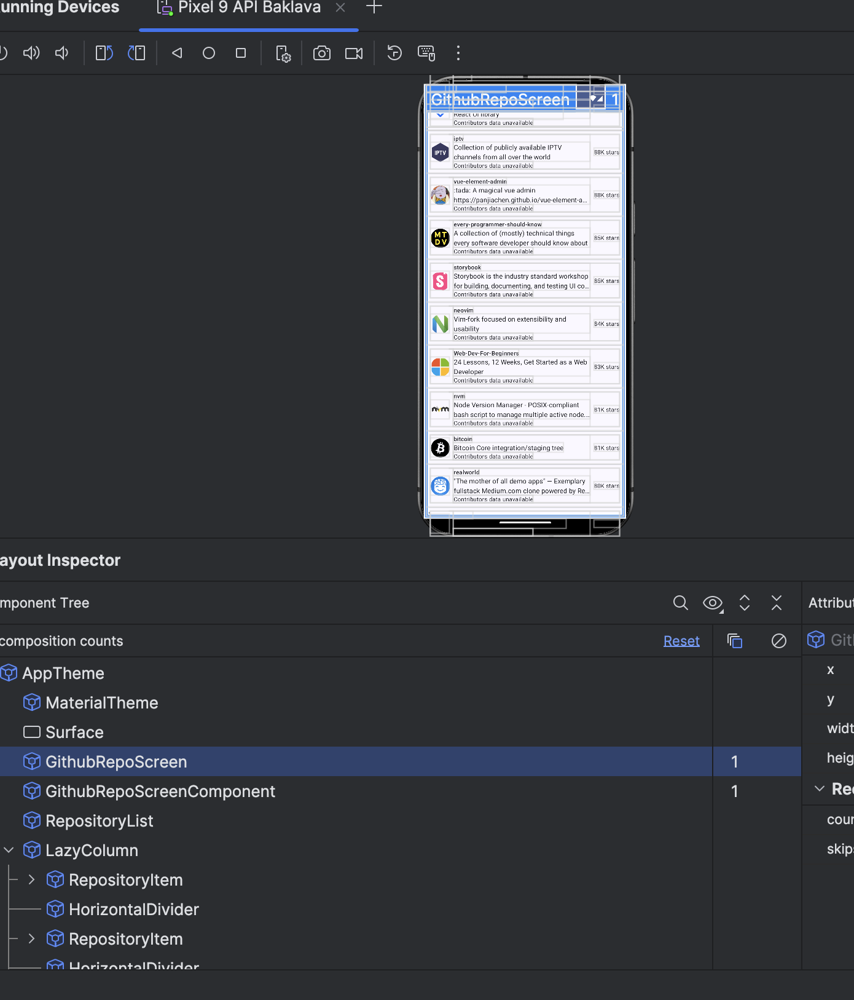

# GitHub Repositories Viewer

## Overview
This Android application utilizes the GitHub REST API to display a list of the 100 most starred GitHub repositories. For each repository, users can view its top contributor in a detailed view.

### Features
1. **List of Top Repositories**: Displays the 100 most starred repositories fetched from GitHub.
2. **Optimized Performance**: Implements concurrency, race condition handling, and lazy fetching to ensure smooth performance and scalability.

## API Endpoints Used
- **Get Most Starred Repositories**
  ```
  GET https://api.github.com/search/repositories?q=stars:>0
  ```
- **Get Contributors for a Repository**
  ```
  GET https://api.github.com/repos/{owner}/{repo}/contributors
  ```

## Key Optimizations
### 1. **Concurrency and Race Condition Handling**
- Ensures thread safety by managing concurrent API calls efficiently.
- Prevents making unnecessary requests for repositories whose contributor data has already been fetched.


### 2. **Lazy Fetching for Large Lists**
- Fetches contributor data only when users scrolls to that list repository items.
- Benefits:
  - **Performance**: Reduces the number of concurrent calls and batches requests.
  - **Scalability**: Processes large datasets efficiently.
  - **UI Optimization**: Updates contributor details lazily as data becomes available.

### 3. **Efficient State Management**
- Updates state only when necessary to reduce network load and improve performance.
- Filters the API call queue using visible item keys.

### 4. **Debouncing Scroll Changes**
- Utilizes `distinctUntilChanged` to trigger recompositions only when visible items change, avoiding unnecessary computations.

### 5. **Keyed Composition and State Hoisting**
- Follows best practices for recomposition optimization in Jetpack Compose.
- Uses `remember` for state scoping and manages state efficiently.


## Implementation Notes
1. The list of repositories and is associated top contributor is fetched on the main screen.
2. A snapshot of visible items in the list ensures efficient state updates based on user interactions.

## Future Enhancements
- Implement retry mechanisms for API failures.
- Add pagination support for repositories beyond the 30 for faster Load times.
- Provide additional repository details, such as open issues and forks, on the details screen.
- Maybe fetch Contributor details and top contributors on the details screen, reducing the API call load.

## Getting Started
1. Clone the repository.
2. Add your GitHub API token to the `local.properties` file for authenticated API requests:
   ```
   githubApiToken=your_token_here
   ```
   ### Troubleshooting Token Permission Issues

If your token doesn't seem to work due to permission restrictions, try commenting out the following line in `AppModule`:

```kotlin
.addInterceptor { chain ->
   val request = chain.request().newBuilder()
   .addHeader("Authorization", "Bearer ${BuildConfig.GITHUB_API_TOKEN}")
   .build()
   chain.proceed(request)
}
```

This will bypass the authorization header. The data would be fetched unauthenticated with rate limit of 60 requests per hour (which is the GitHub API's default rate limit for unauthenticated requests)

 ### Creating local.properties
Here's how to create and configure a `local.properties` file for an Android project:

---

### **Creating `local.properties`**

1. **Navigate to the Root Project Directory**:
   - Open your Android project in your favorite IDE (e.g., Android Studio).
   - Locate the root directory of your project. This is the folder containing the `settings.gradle` or `settings.gradle.kts` file.

2. **Create the `local.properties` File**:
   - If it doesn’t already exist, create a new file in the root directory and name it `local.properties`.(Since local.properties are not commited to github)

3. **Add Your Configuration**:
   - Open the `local.properties` file in a text editor.
   - Add key-value pairs as needed. For example:
     ```properties
     sdk.dir=/path/to/your/android/sdk
     githubApiToken=<api_token>
     ```

4. **Keep It Secure**:
   - Ensure that sensitive information (like passwords or keys) is added here rather than hardcoding it in your codebase.
   - Add the `local.properties` file to your `.gitignore` to prevent it from being checked into version control.

   Example `.gitignore` entry:
   ```
   /local.properties
   ```
This method keeps sensitive and environment-specific configurations secure and separate from your source code.


3. Build and run the project using latest Android Studio.

## Dependencies
- Jetpack Compose for UI.
- Retrofit for API calls.
- Coroutine and Flow for asynchronous data handling.

## Screenshots
Here is a sample screenshot of the application:

<table>
  <tr>
    <td></td>
    <td></td>
  </tr>
</table>


